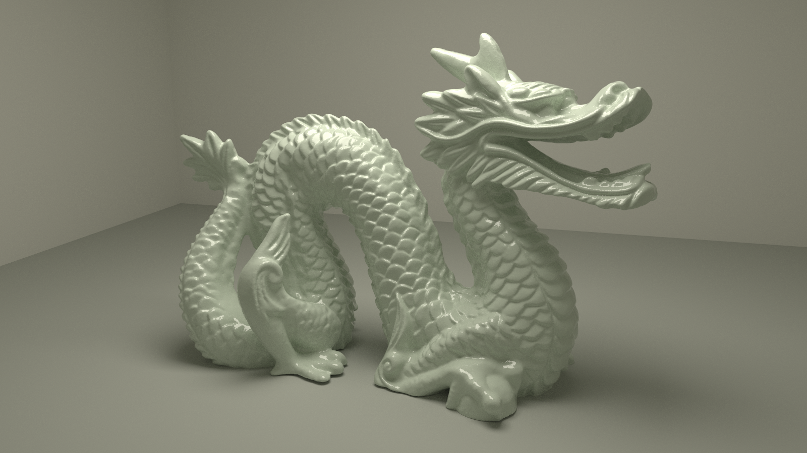
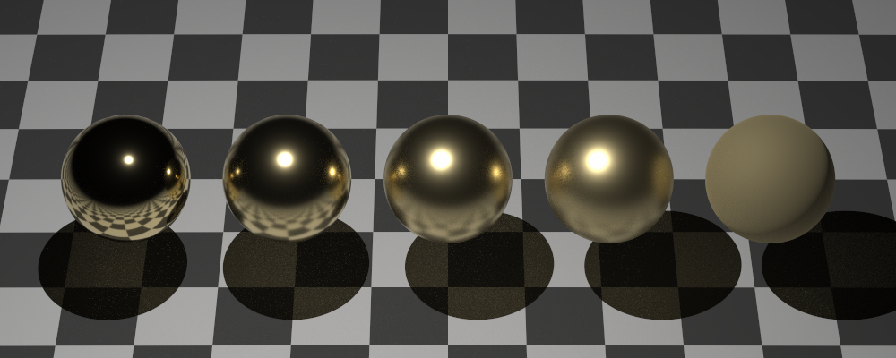

# mango
Mango is a 3D renderer that implements path tracing on the CPU using only the Go standard library.

Mango is also my favourite fruit.

## Goal
This is a learning project!

I'm reading *Physically Based Rendering (3rd & 4th ed.)* by Matt Pharr, Greg Humphreys, and Pat Hanrahan. 

I also find the *Ray Tracing In One Weekend* book series by Peter Shirley, Trevor David Black, and Steve Hollasch
very helpful for alleviating the occasionally overwhelming complexity of PBR.

Links to the books:
- PBR: https://pbrt.org/
- RTIOW: https://raytracing.github.io/

## Example Renders

## Why Go?
Its readability and automatic garbage collection allow me to focus more on path tracing and less on memory management, even if it's at the cost of speed (compared to C/C++).